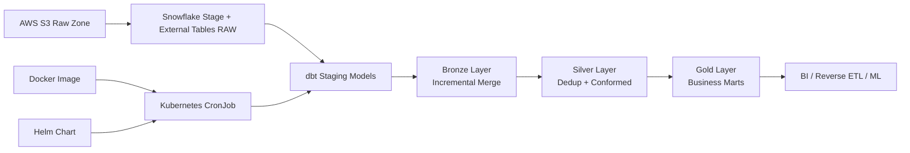

# Lakehousing With dbt + Snowflake + S3 (Bronze/Silver/Gold)

A production-style starter project implementing a medallion architecture on Snowflake, using AWS S3 as the raw data lake, with dbt transformations, containerized execution, and Kubernetes + Helm orchestration.

## New Contributor Quickstart (5 Commands)

```bash
cp .env.local.example .env.local
make dev-up
make creds-rotate
make dbt-seed
make dbt-test
```

Use this path for the fastest first run on a fresh machine. See Development Setup and Procedure below for full details.

## Architecture



## Project Layout

- `dbt_project/`: dbt code including staging, bronze, silver, gold models
- `config/profiles.yml`: dbt Snowflake profile template
- `scripts/setup_snowflake.sql`: S3 integration + Snowflake object bootstrap
- `infrastructure/docker/`: dbt execution image
- `infrastructure/k8s/`: plain Kubernetes deployment manifests
- `infrastructure/helm/dbt-medallion/`: Helm chart for CronJob scheduling

## 1) Snowflake + S3 Setup

1. Create `.env` from `.env.example` and fill your account/user/password values.
2. Run `scripts/setup_snowflake.sql` in Snowflake as an admin role.
3. Replace bucket and IAM role placeholders in the SQL script.
4. Refresh external tables when new files are landed:

```sql
-- scripts/refresh_external_tables.sql
alter external table LAKEHOUSE.RAW.orders_ext refresh;
alter external table LAKEHOUSE.RAW.customers_ext refresh;
```

## 2) Run with Docker (Local)

```bash
cp .env.example .env
make docker-build
make docker-run
```

This runs:

- `dbt deps`
- `dbt debug`
- `dbt run --select bronze silver gold`
- `dbt test`

## Local Dev Environment (Docker + Kind + MinIO + LocalStack)

This project includes a local-first stack to run:

- MinIO for S3-compatible object storage
- LocalStack for AWS API emulation and Secrets Manager
- Kind for Kubernetes-in-Docker
- Helm CronJob deployment for dbt execution

### Prerequisites

- Docker Desktop
- kind
- kubectl
- helm
- awscli
- jq

### Start everything

```bash
cp .env.local.example .env.local
make dev-up
```

### Verify LocalStack seed data

```bash
make localstack-check
make minio-check
```

### Stop everything

```bash
make dev-down
```

### Credential source of truth

All runtime credentials are maintained in LocalStack Secrets Manager and then propagated to:

- local Docker dbt runtime via `.env.local.resolved`
- Kubernetes via `dbt-snowflake-secret` (synced during `make dev-up`)

### Rotate credentials and re-sync

After updating values in `.env.local`, rotate and propagate with one command:

```bash
make creds-rotate
```

### Important note about Snowflake + MinIO

MinIO is for local S3-compatible development only. Snowflake external stages in production should still point to real AWS S3.

## Development Setup and Procedure

This section defines a practical, repeatable workflow for contributors.

### A) One-time developer setup

1. Install tooling: Docker Desktop, kind, kubectl, helm, awscli, jq, Git.
1. Clone repository and move into the project folder.
1. Create local environment file and update values:

```bash
cp .env.local.example .env.local
```

1. Start full local platform (LocalStack, MinIO, Kind, Helm deployment):

```bash
make dev-up
```

1. Validate local dependencies and seeded data:

```bash
make localstack-check
make minio-check
```

1. Validate dbt connectivity and baseline run:

```bash
make dbt-deps
make dbt-debug
make dbt-seed
make dbt-run
make dbt-test
```

### B) Daily development loop

1. Pull latest changes from your working branch.
1. If credentials changed, rotate and sync:

```bash
make creds-rotate
```

1. Run fast validation while editing models:

```bash
make dbt-seed
make dbt-run
make dbt-test
```

1. For container/runtime changes, rebuild and verify:

```bash
make docker-build
make docker-run
```

1. For Kubernetes/Helm changes, template before deploying:

```bash
make helm-template
```

### C) Procedure for model changes

1. Add or update SQL in staging, bronze, silver, or gold models.
1. Add or update seed data if the model depends on controlled reference values.
1. Add schema tests in model YAML (not null, unique, relationships, accepted range).
1. Add singular tests in `dbt_project/tests/` for business rules.
1. Run `make dbt-seed`, `make dbt-run`, and `make dbt-test`.
1. Verify gold outputs and row-level expectations before opening a PR.

### D) Procedure for infra changes

1. For Docker changes, run `make docker-build`.
1. For local platform changes, run `make dev-down` then `make dev-up`.
1. For Helm changes, run `make helm-template` and inspect rendered manifests.
1. For Kubernetes secret-related changes, run `make creds-rotate` and re-check deployment.

### E) Pull request readiness checklist

1. Local commands pass: `make dbt-seed`, `make dbt-run`, `make dbt-test`.
1. If touched infra: `make docker-build` and `make helm-template` pass.
1. Updated docs for any new environment variables, seeds, tests, or operational steps.
1. No hardcoded credentials in committed files.

### F) Common recovery commands

```bash
# Full local stack restart
make dev-down
make dev-up

# Rebuild only local credentials and sync to k8s
make creds-rotate

# Re-run dbt lifecycle
make dbt-seed
make dbt-run
make dbt-test
```

## 3) Run dbt Without Docker

```bash
make dbt-deps
make dbt-debug
make dbt-seed
make dbt-run
make dbt-test
```

## 4) Deploy on Kubernetes (Raw YAML)

```bash
kubectl apply -f infrastructure/k8s/namespace.yaml
kubectl apply -f infrastructure/k8s/secret.example.yaml
kubectl apply -f infrastructure/k8s/configmap.yaml
kubectl apply -f infrastructure/k8s/cronjob.yaml
```

## 5) Deploy with Helm

```bash
helm upgrade --install lakehousing infrastructure/helm/dbt-medallion \
  --namespace lakehouse-dbt \
  --create-namespace \
  --set image.repository=lakehousing-dbt \
  --set image.tag=latest \
  --set snowflake.password='<your-password>'
```

## 6) CI/CD with GitHub Actions

The repository includes GitHub Actions workflows:

- CI workflow: `.github/workflows/ci.yml`
  - runs `dbt deps` + `dbt parse`
  - lints SQL with SQLFluff
  - lints and templates Helm chart
  - builds Docker image for verification
- CD workflow: `.github/workflows/cd.yml`
  - builds and pushes Docker image to GHCR on push to `main` or `prd`
  - runs only when dbt/infra related paths change
  - optional manual Helm deploy using `workflow_dispatch`
- Release workflow: `.github/workflows/release.yml`
  - triggers on semantic version tags like `v1.2.3`
  - publishes immutable image tags to GHCR
  - creates a GitHub Release with generated notes

### Repository setup steps

1. Push this repository to GitHub.
2. Enable GitHub Actions for the repository.
3. In `Settings` > `Actions` > `General`, set Workflow permissions to `Read and write permissions` (required for GHCR push and release publishing).
4. In `Settings` > `Environments`, create environment `production`.
5. Add required reviewers (and optional wait timer) to the `production` environment for approval gates.
6. Add repository secrets listed below.
7. Optionally move deploy secrets into the `production` environment secrets instead of repository-level secrets.

### Required GitHub Secrets for CI/CD

CI workflow (`.github/workflows/ci.yml`):

- No secrets required.

CD workflow deploy job (`.github/workflows/cd.yml`):

- `KUBE_CONFIG_DATA` (base64 kubeconfig)
- `SNOWFLAKE_ACCOUNT`
- `SNOWFLAKE_USER`
- `SNOWFLAKE_PASSWORD`
- `SNOWFLAKE_ROLE`
- `SNOWFLAKE_WAREHOUSE`
- `SNOWFLAKE_DATABASE`
- `SNOWFLAKE_SCHEMA`
- `DBT_TARGET`

Release workflow (`.github/workflows/release.yml`):

- No custom secrets required (uses `GITHUB_TOKEN`).

### Secrets quick reference

| Secret name | Required by | Suggested scope | Example value |
| --- | --- | --- | --- |
| `KUBE_CONFIG_DATA` | CD deploy | `production` environment | `base64 -w 0 ~/.kube/config` output |
| `SNOWFLAKE_ACCOUNT` | CD deploy | `production` environment | `xy12345.us-east-1` |
| `SNOWFLAKE_USER` | CD deploy | `production` environment | `DBT_USER` |
| `SNOWFLAKE_PASSWORD` | CD deploy | `production` environment | `********` |
| `SNOWFLAKE_ROLE` | CD deploy | `production` environment | `TRANSFORMER` |
| `SNOWFLAKE_WAREHOUSE` | CD deploy | `production` environment | `COMPUTE_WH` |
| `SNOWFLAKE_DATABASE` | CD deploy | `production` environment | `LAKEHOUSE` |
| `SNOWFLAKE_SCHEMA` | CD deploy | `production` environment | `RAW` |
| `DBT_TARGET` | CD deploy | `production` environment | `prod` |

### Optional GitHub CLI setup

```bash
# Example: set repository-level secret
gh secret set SNOWFLAKE_ACCOUNT --body "xy12345.us-east-1"

# Example: set production environment secret
gh secret set SNOWFLAKE_PASSWORD --env production --body "<your-password>"
```

### Triggering CD deploy

1. Open Actions in GitHub.
2. Run `CD` workflow manually.
3. Set `deploy=true`.

### Protected production approvals

The deploy job targets the `production` GitHub Environment. To enforce approvals:

1. Go to repository `Settings` > `Environments`.
2. Create environment `production`.
3. Add required reviewers and optional wait timer.
4. Store production-scoped secrets there if desired.

When `CD` deploy runs, GitHub will pause before deployment until approvals are granted.

### Semantic version release

Push a semver tag to trigger immutable release publishing:

```bash
git tag v1.0.0
git push origin v1.0.0
```

## Model Layers

- Bronze:
  - `brz_orders`
  - `brz_customers`
- Silver:
  - `slv_orders`
  - `slv_customers`
- Gold:
  - `gld_daily_revenue`

## Recommended Next Enhancements

1. Add CI with `dbt build` and `sqlfluff` checks.
2. Move secrets to AWS Secrets Manager + External Secrets Operator.
3. Add observability: dbt artifacts upload, run metadata, and alerting.
4. Add more marts (customer 360, retention, product performance).
