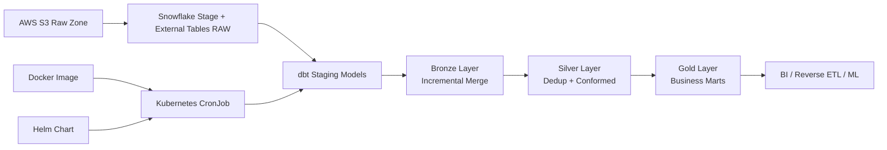
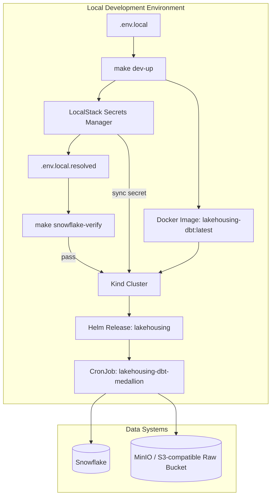
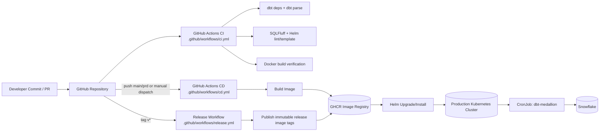

# Lakehousing With dbt + Snowflake + AWS S3 (Bronze/Silver/Gold)

A production-style starter project implementing a medallion architecture on Snowflake, using AWS S3 as the raw data lake, with dbt transformations, containerized execution, and Kubernetes + Helm orchestration.

This project can also be used as a migration reference for legacy data systems moving to a modern data program. The same architecture patterns apply across AWS, GCP, and Azure by substituting equivalent cloud storage, secrets management, and Kubernetes services.

## Quick Navigation

- Full technology stack: `Full Stack`
- Modern platform concepts: `Modern Data Platform and Modern Data Engineering`
- Architecture views: `Architecture`, `Deployment Architecture`, `Production CI/CD Deployment Flow`
- Fastest local path: `New Contributor Quickstart (5 Commands)`
- Snowflake bootstrap and checks: `1) Snowflake + S3 Setup`
- Day-to-day operations: `Local Dev Environment`, `Runbooks`
- Deployment options: `4) Deploy on Kubernetes (Raw YAML)`, `5) Deploy with Helm`
- Automation and release: `6) CI/CD with GitHub Actions`

## Full Stack

| Layer | Technologies Used in This Project |
| --- | --- |
| Data storage and warehouse | Snowflake, S3-compatible object storage (MinIO for local) |
| Data modeling and transformation | dbt Core, dbt-utils package, SQL models (staging, bronze, silver, gold) |
| Data quality and validation | dbt data tests, singular SQL tests |
| Runtime and packaging | Docker, Python 3.12 slim image |
| Orchestration and scheduling | Kubernetes CronJob, Helm chart deployment |
| Local cloud emulation | LocalStack (Secrets Manager and AWS APIs), MinIO |
| Secrets and configuration | LocalStack secret bootstrap, generated `.env.local.resolved`, Kubernetes Secret sync |
| Cluster and platform | Kind (local Kubernetes), kubectl, Helm |
| Automation and delivery | GitHub Actions CI/CD/Release workflows, GHCR image publishing |
| Build and developer tooling | Makefile targets, bash scripts, jq, awscli |

## Modern Data Platform and Modern Data Engineering

A modern data platform is a composable operating model for analytics and data products. It separates storage, compute, transformation, orchestration, and governance so teams can scale independently while still enforcing common standards.

Modern data engineering is the practice of building this platform as software: version-controlled pipelines, test-first transformations, reproducible environments, and automated deploy workflows. The goal is not only to move data, but to deliver trusted, observable, and continuously improving data products.

In this project, that mindset is implemented through:

- Cloud data warehouse compute in Snowflake
- Lake-style raw ingestion and external table access
- SQL-first transformations with dbt and built-in testing
- Containerized runtime for parity across local and cluster execution
- Kubernetes and Helm for repeatable scheduling and deployment
- CI/CD automation for validation, release, and promotion

## Leading-Edge Architecture Patterns (and How This Repo Uses Them)

1. Lakehouse medallion layering:
  Raw and semi-structured data is staged, then promoted through bronze, silver, and gold layers to improve quality, semantics, and business readiness.
2. ELT with warehouse-native transformation:
  Data lands first, then transformations run inside the warehouse for performance and elasticity.
3. SQL-as-code with software engineering controls:
  dbt models, tests, and documentation are versioned and validated in automated workflows.
4. Immutable runtime artifacts:
  dbt runs in a Docker image, reducing environment drift between developer machines and Kubernetes jobs.
5. GitOps-style delivery pipeline:
  Changes flow through CI checks, image build/push, and automated Helm deploy steps.
6. Shift-left operational validation:
  Pre-deploy checks fail fast when Snowflake prerequisites are missing, reducing runtime incident noise.
7. Secret-driven configuration:
  Credentials are managed through LocalStack/Kubernetes secret synchronization rather than hardcoded manifests.
8. Local production simulation:
  Kind + LocalStack + MinIO reproduce core production mechanics so developers can test end-to-end behavior early.

## New Contributor Quickstart (5 Commands)

```bash
cp .env.local.example .env.local
make dev-up
make creds-rotate
make dbt-seed
make dbt-test
```

Use this path for the fastest first run on a fresh machine.

Expected outcome:

- Local services (LocalStack, MinIO, Kind) are running
- Snowflake credentials are synced into `.env.local.resolved` and Kubernetes secret
- dbt seed and tests complete successfully

If setup fails, run:

```bash
make snowflake-verify
```

Then see `Runbooks` for full operational workflows.

## Architecture



## Deployment Architecture



## Production CI/CD Deployment Flow



## Project Layout

- `dbt_project/`: dbt code including staging, bronze, silver, gold models
- `config/profiles.yml`: dbt Snowflake profile template
- `scripts/setup_snowflake.sql`: S3 integration + Snowflake object bootstrap
- `infrastructure/docker/`: dbt execution image
- `infrastructure/k8s/`: plain Kubernetes deployment manifests
- `infrastructure/helm/dbt-medallion/`: Helm chart for CronJob scheduling

## 1) Snowflake + S3 Setup

1. For local development, create `.env.local` from `.env.local.example` and set real Snowflake credentials.

```bash
cp .env.local.example .env.local
make creds-rotate
```

1. Validate Snowflake authentication before running bootstrap SQL:

```bash
docker run --rm --env-file .env.local.resolved lakehousing-dbt:latest \
  "dbt debug --profiles-dir /home/dbt/.dbt --target dev"
```

1. Run `scripts/setup_snowflake.sql` in Snowflake as `ACCOUNTADMIN`.
   - Option A (recommended): open a Snowflake worksheet as `ACCOUNTADMIN`, paste SQL from `scripts/setup_snowflake.sql`, then run it.
   - Option B (CLI): run the same script using your Snowflake CLI (`snowsql` or `snow sql`) if installed.

1. Replace bucket and IAM role placeholders in the SQL script.

1. Refresh external tables when new files are landed:

```sql
-- scripts/refresh_external_tables.sql
alter external table LAKEHOUSE.RAW.orders_ext refresh;
alter external table LAKEHOUSE.RAW.customers_ext refresh;
```

For non-local Docker-only runs, you may still use `.env` and `.env.example` as described in `2) Run with Docker (Local)`.

### Quick check: is bootstrap SQL still needed?

Run these queries in Snowflake:

```sql
show databases like 'LAKEHOUSE';
show warehouses like 'COMPUTE_WH';
show roles like 'TRANSFORMER';
show external tables like 'ORDERS_EXT' in schema LAKEHOUSE.RAW;
show external tables like 'CUSTOMERS_EXT' in schema LAKEHOUSE.RAW;
```

If any object is missing, run `scripts/setup_snowflake.sql`.

## 2) Run with Docker (Local)

```bash
cp .env.example .env
make docker-build
make docker-run
```

This runs:

- `dbt deps`
- `dbt debug`
- `dbt run --select bronze silver gold`
- `dbt test`

## Local Dev Environment (Docker + Kind + MinIO + LocalStack)

This project includes a local-first stack to run:

- MinIO for S3-compatible object storage
- LocalStack for AWS API emulation and Secrets Manager
- Kind for Kubernetes-in-Docker
- Helm CronJob deployment for dbt execution

### Prerequisites

- Docker Desktop
- kind
- kubectl
- helm
- awscli
- jq

### Start everything

```bash
cp .env.local.example .env.local
make dev-up
```

### Verify LocalStack seed data

```bash
make localstack-check
make minio-check
```

### Stop everything

```bash
make dev-down
```

### Credential source of truth

All runtime credentials are maintained in LocalStack Secrets Manager and then propagated to:

- local Docker dbt runtime via `.env.local.resolved`
- Kubernetes via `dbt-snowflake-secret` (synced during `make dev-up`)

### Rotate credentials and re-sync

After updating values in `.env.local`, rotate and propagate with one command:

```bash
make creds-rotate
```

Before deploying or re-deploying Kubernetes jobs, verify Snowflake prerequisites:

```bash
make snowflake-verify
```

### Important note about Snowflake + MinIO

MinIO is for local S3-compatible development only. Snowflake external stages in production should still point to real AWS S3.

## Runbooks

### Local Development Runbook

1. Install prerequisites: Docker Desktop, kind, kubectl, helm, awscli, jq, Git.
1. Create local environment and set real Snowflake credentials:

```bash
cp .env.local.example .env.local
```

1. Bring up the local platform and validate dependencies:

```bash
make dev-up
make localstack-check
make minio-check
```

1. Validate Snowflake prerequisites and dbt execution path:

```bash
make snowflake-verify
make dbt-seed
make dbt-run
make dbt-test
```

1. Daily loop after code changes:

```bash
make dbt-seed
make dbt-run
make dbt-test
```

1. If credentials changed:

```bash
make creds-rotate
make snowflake-verify
```

1. If infrastructure changed:

```bash
make docker-build
make helm-template
```

### Production Operations Runbook

1. Ensure CI checks pass for dbt parsing, SQL linting, Helm validation, and image build.
1. Build and publish image through CD workflow.
1. Deploy with Helm using environment-scoped secrets.
1. Verify CronJob and runtime logs in Kubernetes.
1. For releases, publish semantic tags (`v*`) to create immutable release images.

### Recovery Commands

```bash
# Full local stack restart
make dev-down
make dev-up

# Rebuild only local credentials and sync to k8s
make creds-rotate

# Fail fast if Snowflake role/objects are missing
make snowflake-verify

# Re-run dbt lifecycle
make dbt-seed
make dbt-run
make dbt-test
```

## 3) Run dbt Without Docker

```bash
make dbt-deps
make dbt-debug
make dbt-seed
make dbt-run
make dbt-test
```

## 4) Deploy on Kubernetes (Raw YAML)

```bash
kubectl apply -f infrastructure/k8s/namespace.yaml
kubectl apply -f infrastructure/k8s/secret.example.yaml
kubectl apply -f infrastructure/k8s/configmap.yaml
kubectl apply -f infrastructure/k8s/cronjob.yaml
```

## 5) Deploy with Helm

```bash
helm upgrade --install lakehousing infrastructure/helm/dbt-medallion \
  --namespace lakehouse-dbt \
  --create-namespace \
  --set image.repository=lakehousing-dbt \
  --set image.tag=latest \
  --set snowflake.password='<your-password>'
```

## 6) CI/CD with GitHub Actions

The repository includes GitHub Actions workflows:

The automation pattern is platform-agnostic and can be implemented with other Git-based CI/CD systems such as GitLab CI/CD, Bitbucket Pipelines, Azure DevOps, or Jenkins while preserving the same build/test/deploy stages.

- CI workflow: `.github/workflows/ci.yml`
  - runs `dbt deps` + `dbt parse`
  - lints SQL with SQLFluff
  - lints and templates Helm chart
  - builds Docker image for verification
- CD workflow: `.github/workflows/cd.yml`
  - builds and pushes Docker image to GHCR on push to `main` or `prd`
  - runs only when dbt/infra related paths change
  - optional manual Helm deploy using `workflow_dispatch`
- Release workflow: `.github/workflows/release.yml`
  - triggers on semantic version tags like `v1.2.3`
  - publishes immutable image tags to GHCR
  - creates a GitHub Release with generated notes

### Repository setup steps

1. Push this repository to GitHub.
2. Enable GitHub Actions for the repository.
3. In `Settings` > `Actions` > `General`, set Workflow permissions to `Read and write permissions` (required for GHCR push and release publishing).
4. In `Settings` > `Environments`, create environment `production`.
5. Add required reviewers (and optional wait timer) to the `production` environment for approval gates.
6. Add repository secrets listed below.
7. Optionally move deploy secrets into the `production` environment secrets instead of repository-level secrets.

### Required GitHub Secrets for CI/CD

CI workflow (`.github/workflows/ci.yml`):

- No secrets required.

CD workflow deploy job (`.github/workflows/cd.yml`):

- `KUBE_CONFIG_DATA` (base64 kubeconfig)
- `SNOWFLAKE_ACCOUNT`
- `SNOWFLAKE_USER`
- `SNOWFLAKE_PASSWORD`
- `SNOWFLAKE_ROLE`
- `SNOWFLAKE_WAREHOUSE`
- `SNOWFLAKE_DATABASE`
- `SNOWFLAKE_SCHEMA`
- `DBT_TARGET`

Release workflow (`.github/workflows/release.yml`):

- No custom secrets required (uses `GITHUB_TOKEN`).

### Secrets quick reference

| Secret name | Required by | Suggested scope | Example value |
| --- | --- | --- | --- |
| `KUBE_CONFIG_DATA` | CD deploy | `production` environment | `base64 -w 0 ~/.kube/config` output |
| `SNOWFLAKE_ACCOUNT` | CD deploy | `production` environment | `xy12345.us-east-1` |
| `SNOWFLAKE_USER` | CD deploy | `production` environment | `DBT_USER` |
| `SNOWFLAKE_PASSWORD` | CD deploy | `production` environment | `********` |
| `SNOWFLAKE_ROLE` | CD deploy | `production` environment | `TRANSFORMER` |
| `SNOWFLAKE_WAREHOUSE` | CD deploy | `production` environment | `COMPUTE_WH` |
| `SNOWFLAKE_DATABASE` | CD deploy | `production` environment | `LAKEHOUSE` |
| `SNOWFLAKE_SCHEMA` | CD deploy | `production` environment | `RAW` |
| `DBT_TARGET` | CD deploy | `production` environment | `prod` |

### Optional GitHub CLI setup

```bash
# Example: set repository-level secret
gh secret set SNOWFLAKE_ACCOUNT --body "xy12345.us-east-1"

# Example: set production environment secret
gh secret set SNOWFLAKE_PASSWORD --env production --body "<your-password>"
```

### Triggering CD deploy

1. Open Actions in GitHub.
2. Run `CD` workflow manually.
3. Set `deploy=true`.

### Protected production approvals

The deploy job targets the `production` GitHub Environment. To enforce approvals:

1. Go to repository `Settings` > `Environments`.
2. Create environment `production`.
3. Add required reviewers and optional wait timer.
4. Store production-scoped secrets there if desired.

When `CD` deploy runs, GitHub will pause before deployment until approvals are granted.

### Semantic version release

Push a semver tag to trigger immutable release publishing:

```bash
git tag v1.0.0
git push origin v1.0.0
```

## Model Layers

- Bronze:
  - `brz_orders`
  - `brz_customers`
- Silver:
  - `slv_orders`
  - `slv_customers`
- Gold:
  - `gld_daily_revenue`

## Recommended Next Enhancements

1. Add CI with `dbt build` and `sqlfluff` checks.
2. Move secrets to AWS Secrets Manager + External Secrets Operator.
3. Add observability: dbt artifacts upload, run metadata, and alerting.
4. Add more marts (customer 360, retention, product performance).

## Release Notes

This section is the canonical release communication format for platform, analytics, and delivery changes.

### Release Announcement

This codebase is provided on an "as is" basis for reference and implementation acceleration.
No warranties are provided, express or implied, including fitness for a particular purpose, security hardening, or production readiness.
The author and contributors are not responsible for direct or indirect loss, outages, data issues, or compliance impacts resulting from use, modification, or deployment of this repository.
Each team is responsible for its own architecture review, security validation, governance controls, and operational risk acceptance before production use.

### Current Release Summary

1. Added fail-fast Snowflake verification before Kubernetes deployment (`make snowflake-verify`).
2. Integrated Snowflake verification into local startup path (`make dev-up`).
3. Improved LocalStack Secrets parsing for env rendering and Kubernetes secret synchronization.
4. Fixed AWS CLI compatibility in MinIO checks by removing v2-only pager flags.
5. Added local deployment and production CI/CD architecture diagrams.
6. Consolidated runbooks for faster onboarding and operations.

### Platform Impact Matrix

| Domain | Change | Engineering Impact |
| --- | --- | --- |
| Runtime reliability | Snowflake preflight verification | Prevents launching jobs when role/object prerequisites are missing |
| Configuration resilience | Secret JSON normalization | Reduces failures due to SecretString formatting differences |
| Developer workflow | Runbook consolidation | Faster handoff and lower operational ambiguity |
| Architecture communication | Added deployment diagrams | Improves review quality for design and release planning |

### Principal Review References

Use this checklist for Data Principals or Data Product Owners release sign-off:

1. Architecture alignment: medallion boundaries and ownership are unchanged or explicitly approved.
2. Reliability controls: `make snowflake-verify` passes in the target environment.
3. Security posture: secrets are externally managed and not embedded in code/manifests.
4. Data quality: dbt tests and business-rule tests pass for all impacted models.
5. Operability: CronJob schedule, retries, and resources are validated for expected workload.
6. Deployment integrity: image tag provenance, Helm values, and environment-scoped secrets are correct.
7. Governance traceability: CI/CD run IDs, release tags, and deployment revision evidence are recorded.

### Release Notes Template

```md
## Release <version> - <date>

### Summary
- <1-2 sentence business and platform summary>

### Included Changes
- Data models:
  - <model or layer updates>
- Platform/infra:
  - <k8s/helm/container/secret updates>
- CI/CD:
  - <pipeline or release process updates>

### Validation Evidence
- dbt tests: <pass/fail + run link>
- Snowflake verification: <pass/fail>
- Deployment: <helm revision / job status>

### Risks and Mitigations
- <risk>
- <mitigation>

### Rollback Plan
- <helm rollback command or image rollback step>
```

## Reference Documentation

### dbt

- [dbt docs home](https://docs.getdbt.com/)
- [dbt Core commands](https://docs.getdbt.com/reference/commands/cmd-overview)
- [dbt project configurations (`dbt_project.yml`)](https://docs.getdbt.com/reference/dbt_project.yml)
- [dbt tests](https://docs.getdbt.com/docs/build/data-tests)

### Snowflake

- [Snowflake docs home](https://docs.snowflake.com/)
- [Snowflake SQL command reference](https://docs.snowflake.com/en/sql-reference-commands)
- [Snowflake stages and external tables](https://docs.snowflake.com/en/user-guide/tables-external-intro)
- [Snowflake role-based access control (RBAC)](https://docs.snowflake.com/en/user-guide/security-access-control-overview)

### Kubernetes

- [Kubernetes docs home](https://kubernetes.io/docs/)
- [CronJob concept](https://kubernetes.io/docs/concepts/workloads/controllers/cron-jobs/)
- [ConfigMap concept](https://kubernetes.io/docs/concepts/configuration/configmap/)
- [Secret concept](https://kubernetes.io/docs/concepts/configuration/secret/)

### Helm

- [Helm docs home](https://helm.sh/docs/)
- [Helm chart template guide](https://helm.sh/docs/chart_template_guide/)
- [Helm commands reference](https://helm.sh/docs/helm/)
- [Helm upgrade command](https://helm.sh/docs/helm/helm_upgrade/)
